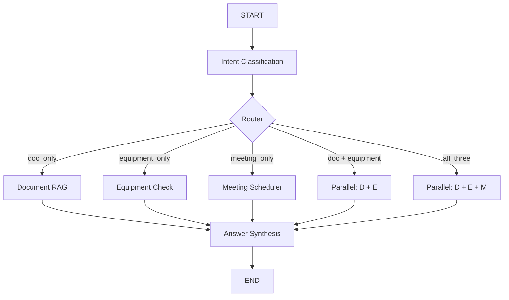

```mermaid
graph TD
    START[START] --> I[Intent Classification]
    I --> R{Router}
    
    R -->|doc_only| D[Document RAG]
    R -->|equipment_only| E[Equipment Check]
    R -->|meeting_only| M[Meeting Scheduler]
    R -->|doc + equipment| P[Parallel: D + E]
    R -->|all_three| P2[Parallel: D + E + M]
    
    D --> A[Answer Synthesis]
    E --> A
    M --> A
    P --> A
    P2 --> A
    
    A --> END[END]
```